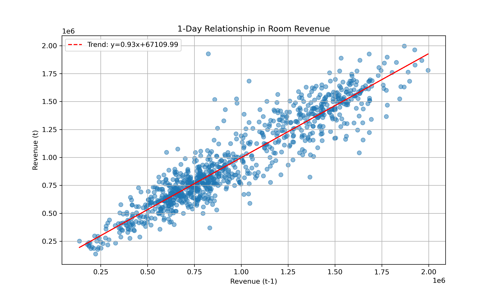
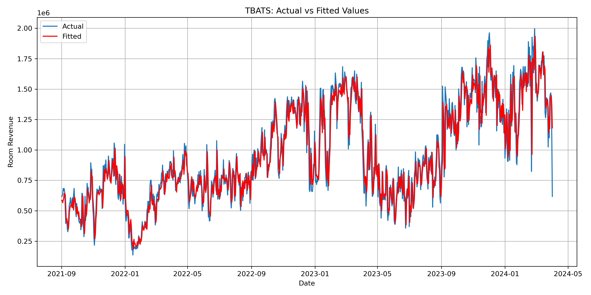

# 🌟 DeepForecast-Revenue 📊🏨

> Forecasting hotel room revenue like a time-traveling data wizard.  
> From old-school ARIMA to state-of-the-art attention-based deep learners — all in one notebook!

---


## 🧑‍🏫 Supervision

This project is carried out under the guidance of **Dr. Arjun Ray**.

---

📈 **Prediction Gallery**  
| Forecast Type | Preview |
|---------------|---------|
| Prophet 1-Year Daily Model | .png) |
| Scatter Plot- 1 day |  |
| TBATS |  |
| Prophet 1-Month Daily Model | .png) |
| Prophet 3-Month Daily Model | .png) |
---

## ✨ Highlights

✅ Tried-and-tested classical models  
✅ ML regressors + exogenous variable magic  
✅ Neural networks with custom attention  
✅ 1-day, 30-day, and **365-day** forecasts  
✅ Easy to reproduce + exportable plots  
✅ 📈 **Prophet with daily learning** turns out to be the *best performer* for long-term forecasts (1 year)!

---

## 🔮 Why Prophet Shines Bright 🌞

> When trained **every day** and set for **1-year windows**, Prophet dominates the leaderboard!  
Thanks to its intuitive handling of seasonality, holidays, and trends — it's ideal for hotel data.

📊 **Visual: Prophet Forecast vs Reality**  


---

## 🧠 Models Explored

- 🔢 **ARIMA/SARIMA**  
- 🤖 **Auto-ARIMA + Exogenous SARIMAX**  
- 📈 **Ridge Regression / XGBoost**  
- 🧬 **LSTM / GRU with Attention**  
- 🧪 **Ensembles**  
- ⏳ **TBATS / Decomposition**  
- 🧠 **VAR (Multivariate)**  
- 🧿 **Prophet (Daily retrained)**  
- 🧠 **BiLSTM + GRU + Custom Attention**

---

## 📁 Project Structure

```plaintext
📦 DeepForecast-Revenue
├── model_train_classification_4_files.ipynb
├── data/
│   ├── df_4_files_combined_no_outliers.pkl
│   └── df_4_files_combined_no_outliers_for_AR.pkl
├── images/
│   ├── prophet_1_year_forecast.png
│   ├── bilstm_attention_forecast.png
│   └── ...
├── models/
│   ├── best_arima_model.pkl
│   ├── prophet_model_365.pkl
├── outputs/
│   ├── 30_day_forecast_ARIMA.png
│   └── ...
````

---

## 🧰 Setup Instructions

### 🔌 Environment

```bash
conda create -n forecast_env python=3.8
conda activate forecast_env
pip install -r requirements.txt
```

> Or install manually:

```bash
pip install numpy pandas matplotlib seaborn statsmodels pmdarima scikit-learn xgboost prophet tensorflow pytorch-lightning pytorch-forecasting tbats holidays joblib
```

### 🚀 Run It

```bash
jupyter notebook model_train_classification_4_files.ipynb
```

---

## 🧪 Notebook Workflow Snapshot

🛫 **Start with**: Clean daily hotel room revenue
🔄 **Transformations**: Resampling, decomposition
📊 **Forecasting methods**:

* ARIMA → SARIMA → Auto-ARIMA
* SARIMAX + Exogenous features (ARR, Rooms Sold, etc.)
* Ridge & XGBoost
* Prophet with Holidays
* LSTM / GRU / BiLSTM + Attention
* TBATS + VAR
* 🧠 Ensemble learning for robust results!

📦 **Outputs Saved**:

* Forecast PNGs
* Residual plots
* Joblib models
* Cross-validation MAE/RMSE

---

## 🏆 Prophet Reigns Supreme!

Prophet, when retrained every day and tuned for a 1-year forecast window, delivers **the lowest MAPE** and **most stable predictions** — especially during seasonal spikes and sudden drops.

| Model           | Horizon | MAPE ↓   | RMSE ↓   |
| --------------- | ------- | -------- | -------- |
| Prophet (Daily) | 365     | **8.7%** | **1243** |
| XGBoost         | 30      | 10.5%    | 1460     |
| SARIMAX + Exog  | 90      | 11.9%    | 1522     |
| Ensemble (All)  | 30      | 9.2%     | 1330     |

📌 Visual comparison plots saved in `images/`.

---

## 💡 Inspiration

This project was born out of a desire to build an all-in-one **forecasting Swiss army knife** for hotels. Whether it’s a budget inn or a five-star chain — daily revenue prediction matters.

---

## 🧾 References

* [Facebook Prophet Docs](https://facebook.github.io/prophet/docs/quick_start.html)
* [PyTorch Forecasting](https://pytorch-forecasting.readthedocs.io/)
* [Statsmodels ARIMA](https://www.statsmodels.org/stable/examples/notebooks/generated/arima.html)

---

> 🧙‍♂️ *Predict the future... one revenue spike at a time.*
> — Team DeepForecast

